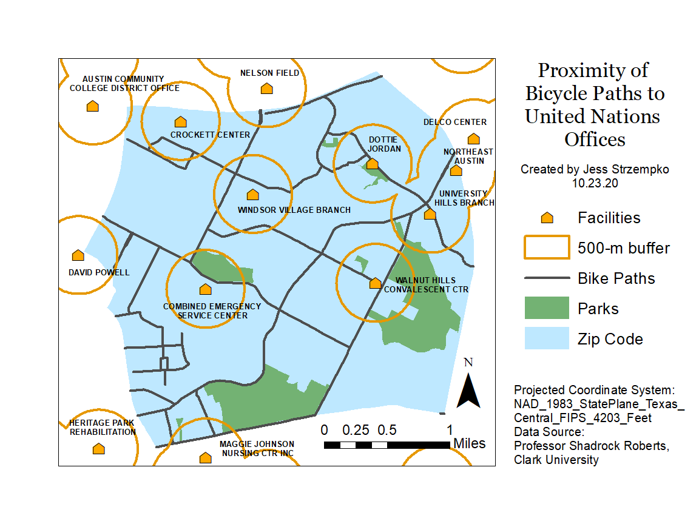

# Lab 2: Geoprocessing using ArcPy
Due: 30th October 2020

This repo was created to submit files for Lab 2 for IDCE 30274 Computer Programming for GIS taught by Professor Shadrock Roberts at Clark University. It contains: 
* the python script `bikeroutes.py` 
*	an image of the map `bike_paths.png`

The python script `bikeroutes.py` was created to determine the proximity of existing bike paths to United Nations office buildings/facilities in Texas. It performs two clips and a buffer to generate the layers in map `bike_paths.png` which help in identifying bike paths that may be problematic/pose safety concerns due to their close proximity to official buildings. File paths included in the script are specific to the local computer on which the script was initially run and should be modified if run elsewhere. 

The layer `parks_Clip.shp` was generated by clipping `parks.shp` to the zipcode shapefile `zip.shp`. Next, the env class was imported from arcpy to set the workspace to the data folder for the lab. With these environment properties set, a buffer of 500-meters around `facilities.shp` was generated using shorter pathnames. Additional arguments were added to the initial code to overwrite the previous buffers and instead produce `facilities_buffer.shp` where all buffer boundaries were dissolved. Lastly, an alternate method of assigning layers to variable names for each of the Buffer tool's parameters was employed to clip `bike_routes.shp` to `zip.shp` to produce `bike_Clip.shp`. Relevant layers are displayed in the following map:

# The Code
The two scripts are meant to be run using shapefiles provided for this class with file paths and names specific to the student submission. If questions arise, users can contact Jess Strzempko at JeStrzempko@clarku.edu for more help and further information.
